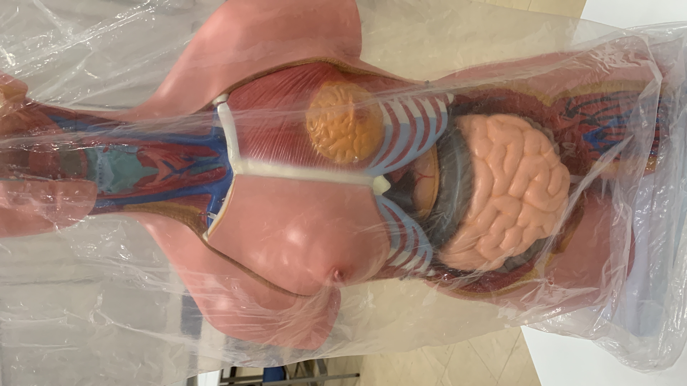
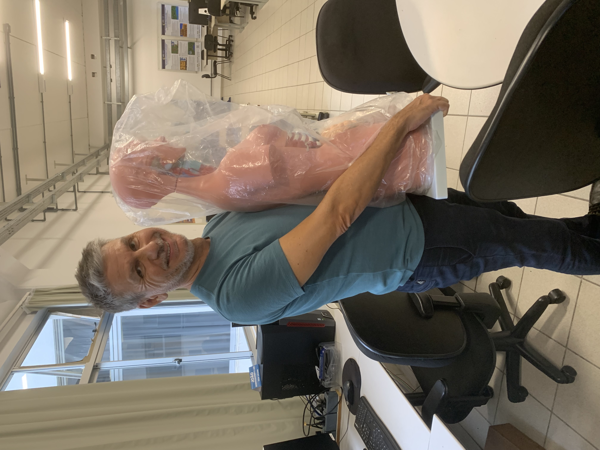

# Anotações das reuniões  

Material de TCC1: [MarcellaCoelhoBritoNunes](MarcellaCoelhoBritoNunes)  

  
  

## 2024-03-26 - 21:32

Achou dois correlatos e está fazendo partes do Pré-projeto. Enviei os links:

- <https://www.furb.br/dsc/tcc/index.php?cd=3&par=1> - Para achar o TCC.  
- <https://github.com/orgs/gcgfurb/repositories?type=archived&q=tcc_> - para pegar o TCC, no caso o projeto.  

Disse que poderia usar como 3a correlato o Virtuali-tee da Curiscope.  

## 2024-03-27 - 15:24

[_Correlatos](_Correlatos)  

## 2024-04-01 - 20:26

Revisão do Pré-projeto.  
Vários ajustes, mas está no caminho certo.  
[2023-03-26_PreProjeto.docx](2023-03-26_PreProjeto.docx)  

## 2024-04-19 - 17:22

[Revisão: 2023-04-17_PreProjeto.docx](2023-04-17_PreProjeto.docx)  

## 2024-08-15 - 17:18

\[Dalton] profa. Tomio pegar boneco anatômico emprestado.  

Curso Unity
  Udemey

Onde testar __
  Presencial
  Cria um questionário
  Interação FURB:26/09
  Tomio:
  Laboratório de Anatomia:

___  
Unity 2022.3.31f1
Realidade Aumentada: Vuforia
Digitalização 3D:    PolyCam

1) Ter um APP com RA

2) Digitalização (PolyCam)
    https://poly.cam (estudar)
  \[Dalton] LiDAR (CCT): Fábio

3) Marcar Tomio reunião TCC

  troco digitalizado    .. ok
  órgão digitalizado    .. intestino
        todos os órgãos

### Tarefa 2024-08-15

Roda o código de RV
Curso Udemy
atendimento.ldtt@gmail.com
Furb2024#

https://www.udemy.com/course/o-guia-definitivo-para-desenvolvimento-de-jogos-com-unity/learn/lecture/8369712?start=0#overview  

## 2024-08-29 - 17:29

Pegar ideias do Virtuali-Tee e implementar no App RV-Aula  

### 04/09 Digitalização
  
- tcc_EricoHenriqueKreusch (pé)  
- tcc_FelipeKriegerBuche (bicho centro de exposição)  
- tcc_GuilhermeSouzaDosSantos_JennyferAraujo (hardware museu)  
- tcc_MarcellaCoelhoBritoNunes (corpo anatômico)  

### 12/09 Professora Tomio

Pedir informações para Tomio:  

- valor pago pelo boneco?  
- texto da BNCC (justificativa)  

[2024-09-19_AppTelas](2024-09-19_AppTelas.pdf)  
